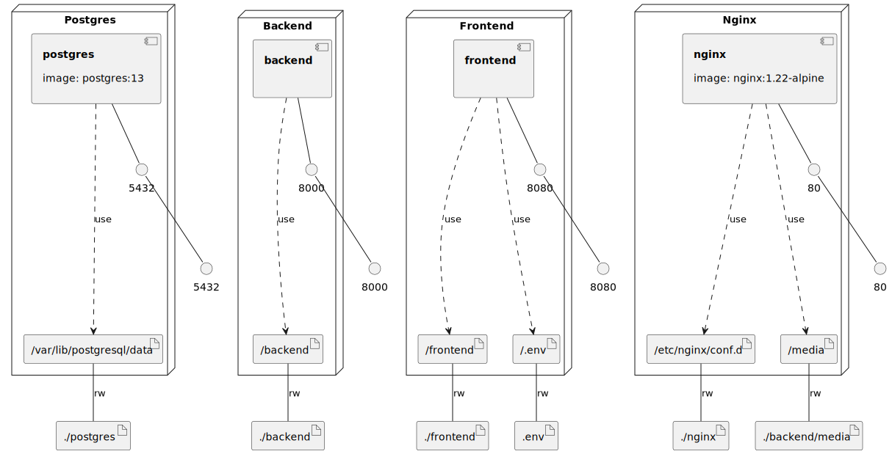

<h1>
    
</h1>

[![Discord Server][discord-badge]][discord]

[discord]: https://discord.gg/sutqNShRRs
[discord-badge]: https://img.shields.io/discord/897066363951128586?color=%237289DA&logo=discord&logoColor=ffffff

A collaborative decompilation and reverse engineering website, built with Next.js and Django.

## Contributing

Contributions are very much welcome! You may want to [join our Discord server](https://discord.gg/sutqNShRRs).

To learn more, see [CONTRIBUTING.md](docs/CONTRIBUTING.md)

## License
decomp.me uses the MIT license. All dependencies may contain their own licenses, which decomp.me respects.

### Infrastructure model

- [backend component model](.infragenie/backend_component_model.svg)

---
